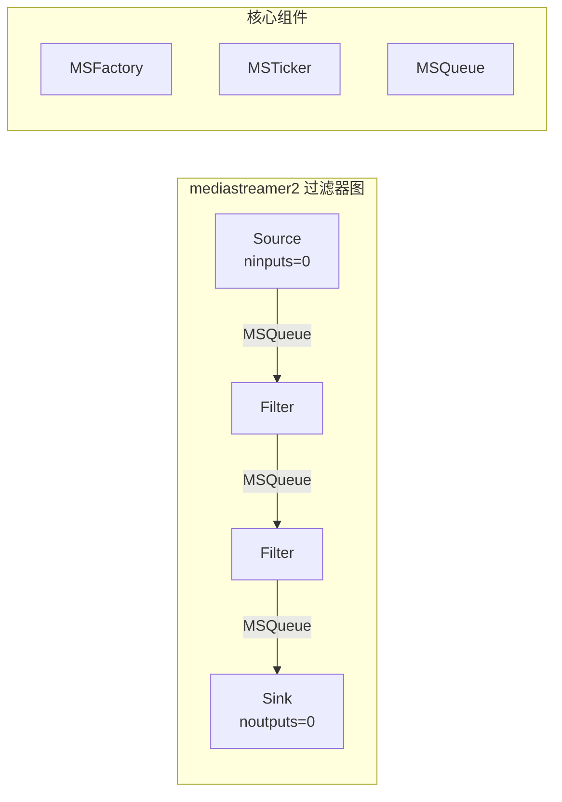
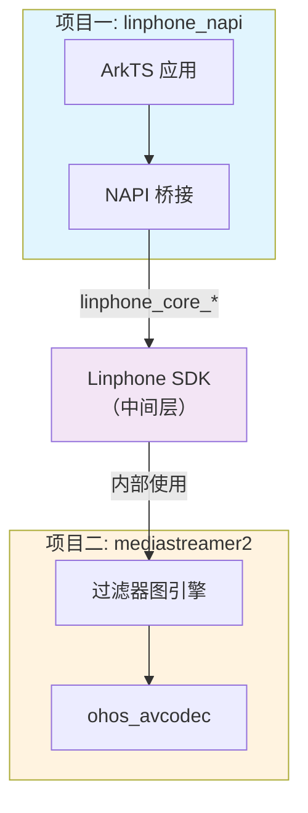
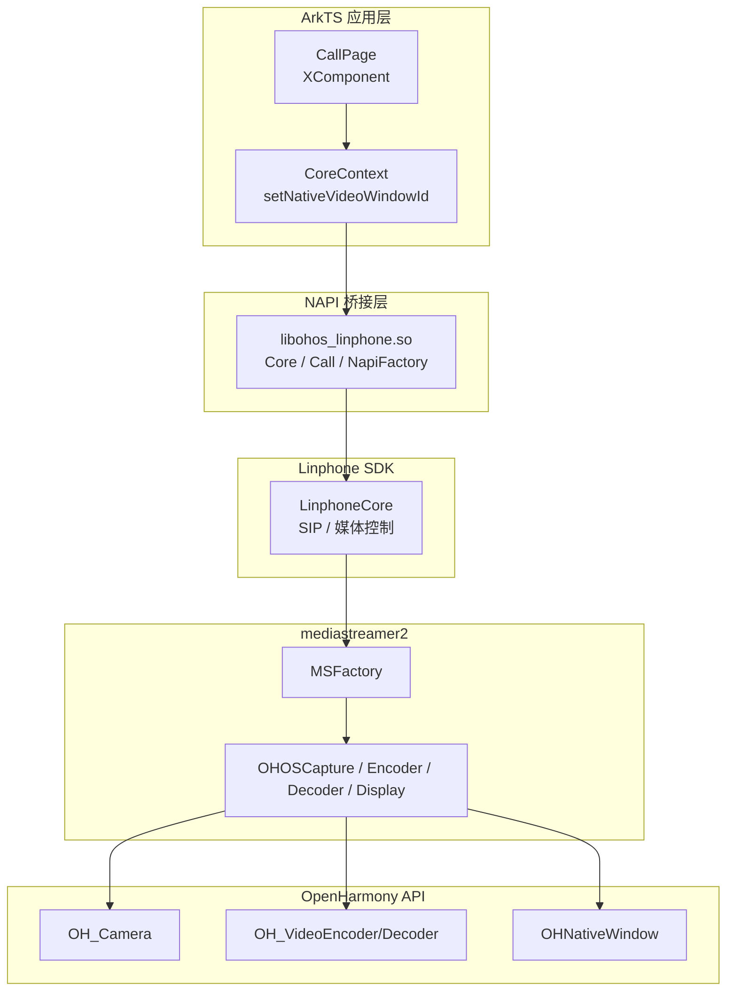
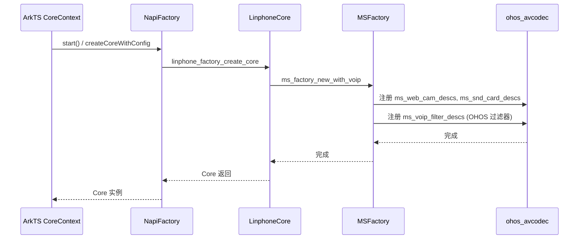
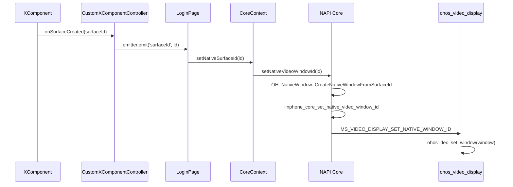
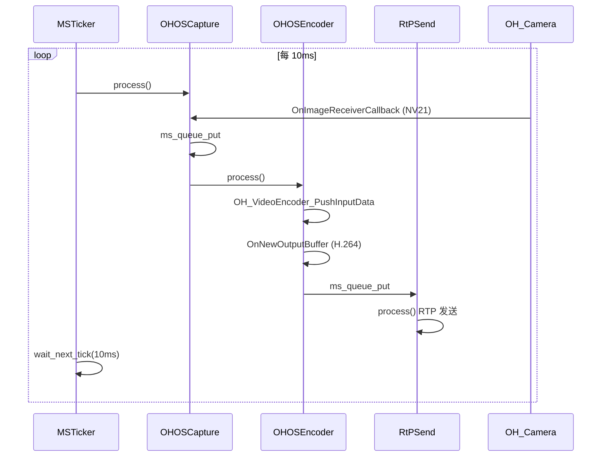

# LinphoneOH 项目架构与流程说明

本文档分别介绍 **mediastreamer2** 与 **linphone_napi** 两个项目，再说明它们如何串联，并绘制架构图与时序图。

> 若使用支持 Mermaid 的查看器（如 VS Code、GitHub、Typora），可渲染下方 Mermaid 图表。

---

## 一、项目一：mediastreamer2

### 1.1 项目定位

**mediastreamer2** 是 Linphone 的流媒体引擎，负责语音/视频通话中的媒体处理与传输。它由 Belledonne Communications 开发，采用 AGPLv3 或商业许可双授权。

### 1.2 核心职责

- **音频**：采集、编解码、播放、回声消除
- **视频**：采集、编解码、渲染、屏幕共享
- **网络**：RTP/SRTP 打包、ICE/STUN、带宽控制
- **加密**：SRTP、ZRTP、DTLS-SRTP

### 1.3 过滤器图架构



```
┌─────────────────────────────────────────────────────────────────────────────┐
│                        mediastreamer2 过滤器图模型                            │
├─────────────────────────────────────────────────────────────────────────────┤
│                                                                             │
│   [Source] ──MSQueue──► [Filter] ──MSQueue──► [Filter] ──MSQueue──► [Sink]   │
│   ninputs=0             处理单元                noutputs=0                    │
│                                                                             │
│   核心组件：                                                                  │
│   • MSFactory: 过滤器工厂，注册/创建过滤器                                     │
│   • MSFilter:  处理单元 (init/preprocess/process/postprocess/uninit)         │
│   • MSQueue:   过滤器间数据队列 (mblk_t)                                      │
│   • MSTicker:  调度线程，每 10ms 驱动一次图                                    │
│                                                                             │
└─────────────────────────────────────────────────────────────────────────────┘
```

### 1.4 OHOS 鸿蒙化模块 (ohos_avcodec)

| 模块 | 文件 | 功能 | 鸿蒙 API |
|------|------|------|----------|
| 视频采集 | ohos_video_capture.cpp | 摄像头采集 | OH_Camera |
| 帧接收 | ohos_video_receiver.cpp | 相机帧回调 | OH_ImageReceiverNative |
| 视频编码 | ohos_video_h264_encoder.cpp | H.264 编码 | OH_VideoEncoder |
| 视频解码 | ohos_video_h264_decoder.cpp | H.264 解码 | OH_VideoDecoder |
| 视频显示 | ohos_video_display.cpp | OpenGL 渲染 | EGL + OHNativeWindow |
| 音频设备 | ohos_dev.cpp | 采集/播放 | OH_AudioCapturer/Renderer |

### 1.5 mediastreamer2 内部架构图

```
┌─────────────────────────────────────────────────────────────────────────────┐
│                         mediastreamer2 内部架构                               │
└─────────────────────────────────────────────────────────────────────────────┘

┌─────────────────────────────────────────────────────────────────────────────┐
│  MSFactory (工厂)                                                             │
│  ├── ms_voip_filter_descs[]  → 注册所有 VoIP 过滤器                           │
│  ├── ms_web_cam_descs[]      → ms_cam_ohos_video_capture_desc (OHOS 优先)    │
│  └── ms_snd_card_descs[]     → ohos_snd_card_desc                            │
└─────────────────────────────────────────────────────────────────────────────┘
                                    │
                                    ▼
┌─────────────────────────────────────────────────────────────────────────────┐
│  MSTicker (调度)                                                             │
│  ┌─────────────────────────────────────────────────────────────────────┐   │
│  │  while(run) {                                                        │   │
│  │    run_tasks();                                                      │   │
│  │    run_graphs(execution_list);  // 从 Source 递归执行                   │   │
│  │    wait_next_tick(10ms);                                             │   │
│  │  }                                                                   │   │
│  └─────────────────────────────────────────────────────────────────────┘   │
└─────────────────────────────────────────────────────────────────────────────┘
                                    │
                                    ▼
┌─────────────────────────────────────────────────────────────────────────────┐
│  Filter Graph (OHOS 视频发送链)                                               │
│                                                                             │
│  OHOSCaptureVido ──► PixConv ──► SizeConv ──► OHOSVideoEncoder ──► RtPSend    │
│  (OH_Camera)         (格式)     (分辨率)   (OH_VideoEncoder)    (RTP)      │
└─────────────────────────────────────────────────────────────────────────────┘

┌─────────────────────────────────────────────────────────────────────────────┐
│  Filter Graph (OHOS 视频接收链)                                               │
│                                                                             │
│  RtPRecv ──► OHOSVideoDecoder ──► OHOSOpenGLDisplay                          │
│  (RTP)        (OH_VideoDecoder)   (EGL + OHNativeWindow)                     │
└─────────────────────────────────────────────────────────────────────────────┘
```

---

## 二、项目二：linphone_napi

### 2.1 项目定位

**linphone_napi** 是鸿蒙应用层项目，通过 **Node-API (NAPI)** 将 Linphone SDK 暴露给 ArkTS，实现基于 ArkUI 的 VoIP 通话应用。

### 2.2 核心职责

- **NAPI 桥接**：ArkTS ↔ C++ Linphone SDK
- **UI 封装**：通话页、登录页、联系人等
- **Surface 绑定**：XComponent Surface → 视频显示窗口
- **事件驱动**：emitter 事件、回调监听

### 2.3 目录结构

```
linphone_napi/
├── entry/                          # 应用入口
│   └── src/main/ets/
│       ├── pages/
│       │   ├── CallPage.ets        # 通话页（视频显示、控制按钮）
│       │   ├── LoginPage.ets      # 登录页（监听 surfaceId）
│       │   ├── HomePage.ets       # 联系人、拨号
│       │   └── CustomXComponentController.ets  # XComponent 控制器
│       └── utils/
│           ├── CoreContext.ets    # Core 单例、Surface 设置
│           └── CorePreferences.ets
│
└── ohos_linphone/                  # NAPI 原生模块
    └── src/main/
        ├── cpp/                    # C++ 实现
        │   ├── napi_init.cpp       # 模块注册
        │   ├── factory/napi_factory.cpp
        │   ├── core/core.cpp       # Core 绑定
        │   ├── call/call.cpp
        │   ├── account/, address/, authInfo/...
        │   └── thirdparty/arm64-v8a/  # 预编译库
        └── ets/
            └── Factory.ets         # 导入 libohos_linphone.so
```

### 2.4 NAPI 导出对象

```
libohos_linphone.so (Init)
  ├── Config
  ├── Core          ← 核心：setNativeVideoWindowId, setPreviewWindowId
  ├── Address
  ├── Account / AccountParams
  ├── AuthInfo
  ├── Call / CallParams / CallListener
  ├── MagicSearch / SearchResult
  ├── NapiFactory   ← 创建 Core、Config
  └── VideoDefinition
```

### 2.5 linphone_napi 内部架构图

```
┌─────────────────────────────────────────────────────────────────────────────┐
│                         linphone_napi 内部架构                                │
└─────────────────────────────────────────────────────────────────────────────┘

┌─────────────────────────────────────────────────────────────────────────────┐
│  ArkTS 层 (entry)                                                             │
│  ┌─────────────┐  ┌─────────────┐  ┌─────────────┐  ┌─────────────┐        │
│  │  CallPage   │  │  LoginPage   │  │  HomePage   │  │ CoreContext │        │
│  │  XComponent │  │  emitter.on │  │  拨号/联系人 │  │  单例管理   │        │
│  └──────┬──────┘  └──────┬──────┘  └──────┬──────┘  └──────┬──────┘        │
│         │                │                │                │                │
│         └────────────────┴────────────────┴────────────────┘                │
│                                    │                                         │
│                          import { Core, Factory } from "@ohos/linphone"      │
└─────────────────────────────────────┬───────────────────────────────────────┘
```

```
┌─────────────────────────────────────────────────────────────────────────────┐
│  NAPI 层 (ohos_linphone)                                                      │
│  ┌─────────────────────────────────────────────────────────────────────┐   │
│  │  libohos_linphone.so                                                  │   │
│  │  ├── Core::SetNativeVideoWindowId(id) → linphone_core_set_native_*    │   │
│  │  ├── Core::SetPreviewWindowId(id)                                    │   │
│  │  ├── Core::SetVideoCaptureEnabled / SetVideoDisplayEnabled           │   │
│  │  └── NapiFactory::createCoreWithConfig → linphone_factory_create_*   │   │
│  └─────────────────────────────────────────────────────────────────────┘   │
└─────────────────────────────────────┬───────────────────────────────────────┘
```

```
┌─────────────────────────────────────────────────────────────────────────────┐
│  依赖库 (thirdparty)                                                          │
│  linphone, mediastreamer2, ortp, bctoolbox, belle-sip, belr                  │
└─────────────────────────────────────────────────────────────────────────────┘
```

---

## 三、两项目串联

### 3.1 两项目关系图



### 3.2 调用链关系

```
ArkTS (CallPage) 
    → core.setNativeVideoWindowId(surfaceId)
    → NAPI Core::SetNativeVideoWindowId
    → OH_NativeWindow_CreateNativeWindowFromSurfaceId(surfaceId)
    → linphone_core_set_native_video_window_id(core, window)
    → LinphoneCore 内部配置
    → mediastreamer2 的 VideoStream 显示 filter
    → MS_VIDEO_DISPLAY_SET_NATIVE_WINDOW_ID
    → ohos_video_display (ohos_dec_set_window)
```

**linphone_napi 不直接调用 mediastreamer2**，而是通过 Linphone SDK 间接使用。Linphone SDK 内部创建 MSFactory、VideoStream、AudioStream，并组装 mediastreamer2 的过滤器图。

### 3.3 整体架构图



```
┌─────────────────────────────────────────────────────────────────────────────────────────────┐
│                        LinphoneOH 整体架构                                                    │
└─────────────────────────────────────────────────────────────────────────────────────────────┘

┌─────────────────────────────────────────────────────────────────────────────────────────────┐
│  ArkTS 应用层 (entry)                                                                        │
│  ┌─────────────────────────────────────────────────────────────────────────────────────┐   │
│  │  CallPage   │  XComponent  │  emitter  │  CoreContext  │  setNativeVideoWindowId     │   │
│  └─────────────────────────────────────────────────────────────────────────────────────┘   │
└─────────────────────────────────────────────┬───────────────────────────────────────────────┘
                                              │ import
                                              ▼
┌─────────────────────────────────────────────────────────────────────────────────────────────┐
│  NAPI 桥接层 (ohos_linphone)                                                                  │
│  ┌─────────────────────────────────────────────────────────────────────────────────────┐   │
│  │  libohos_linphone.so  │  Core / Call / Account / NapiFactory  │  SurfaceId → Window   │   │
│  └─────────────────────────────────────────────────────────────────────────────────────┘   │
└─────────────────────────────────────────────┬───────────────────────────────────────────────┘
                                              │ 链接
                                              ▼
┌─────────────────────────────────────────────────────────────────────────────────────────────┐
│  Linphone SDK                                                                                │
│  ┌─────────────────────────────────────────────────────────────────────────────────────┐   │
│  │  LinphoneCore  │  LinphoneCall  │  LinphoneFactory  │  SIP / 媒体 控制                 │   │
│  └─────────────────────────────────────────────────────────────────────────────────────┘   │
└─────────────────────────────────────────────┬───────────────────────────────────────────────┘
                                              │ 内部使用
                                              ▼
┌─────────────────────────────────────────────────────────────────────────────────────────────┐
│  mediastreamer2 (含 ohos_avcodec)                                                             │
│  ┌─────────────────────────────────────────────────────────────────────────────────────┐   │
│  │  MSFactory  │  MSTicker  │  Filter Graph  │  OHOSCapture  │  OHOSEncoder/Decoder    │   │
│  │  OHOSDisplay │  OH_AudioCapturer/Renderer  │  OH_VideoEncoder/Decoder               │   │
│  └─────────────────────────────────────────────────────────────────────────────────────┘   │
└─────────────────────────────────────────────┬───────────────────────────────────────────────┘
                                              │ 调用
                                              ▼
┌─────────────────────────────────────────────────────────────────────────────────────────────┐
│  OpenHarmony 平台 API                                                                        │
│  OH_Camera  │  OH_ImageReceiverNative  │  OH_VideoEncoder/Decoder  │  OH_AudioCapturer     │
│  OH_AudioRenderer  │  OHNativeWindow  │  EGL / OpenGL ES2                                  │
└─────────────────────────────────────────────────────────────────────────────────────────────┘
```

### 3.4 媒体数据流架构图

```
┌─────────────────────────────────────────────────────────────────────────────────────────────┐
│                        视频发送流 (本地 → 远端)                                                │
└─────────────────────────────────────────────────────────────────────────────────────────────┘

  OH_Camera          mediastreamer2 Filter Graph                    Linphone
  ┌─────────┐       ┌─────────────────────────────────────┐       ┌─────────┐
  │ 摄像头   │       │ OHOSCapture → PixConv → SizeConv     │       │  SIP    │
  │ 采集    │ ────► │ → OHOSEncoder → RtPSend              │ ────► │  信令   │
  │ NV21    │       │ (RTP)                                 │       │  协商   │
  └─────────┘       └─────────────────────────────────────┘       └─────────┘
       │                              │                                    │
       │                              │                                    │
       ▼                              ▼                                    ▼
  OH_ImageReceiverNative         OH_VideoEncoder                    RTP/UDP
  VideoFrameReceiver             OH_AVCodec                        网络发送


┌─────────────────────────────────────────────────────────────────────────────────────────────┐
│                        视频接收流 (远端 → 本地)                                                │
└─────────────────────────────────────────────────────────────────────────────────────────────┘

  Linphone          mediastreamer2 Filter Graph                    ArkTS
  ┌─────────┐       ┌─────────────────────────────────────┐       ┌─────────┐
  │  RTP    │       │ RtPRecv → OHOSDecoder → OHOSDisplay   │       │XComponent│
  │ 接收    │ ────► │ (OH_VideoDecoder) (EGL+OHNativeWindow)│ ────► │ Surface  │
  └─────────┘       └─────────────────────────────────────┘       └─────────┘
       │                              │                                    │
       ▼                              ▼                                    ▼
  RTP/UDP 网络              OH_VideoDecoder                    OHNativeWindow
                            NV21 → I420 → ARGB                 渲染到屏幕
```

---

## 四、时序图

### 4.1 应用启动与 Core 初始化时序



```
┌──────────┐     ┌──────────────┐     ┌──────────────┐     ┌──────────────┐     ┌──────────────┐
│  ArkTS   │     │ NapiFactory  │     │ LinphoneCore │     │ MSFactory   │     │ mediastreamer2│
│ CoreContext│   │              │     │              │     │             │     │ ohos_avcodec  │
└─────┬────┘     └──────┬───────┘     └──────┬───────┘     └──────┬──────┘     └──────┬───────┘
      │                 │                    │                    │                    │
      │ start()         │                    │                    │                    │
      │────────────────►│                    │                    │                    │
      │                 │ createCoreWithConfig                   │                    │
      │                 │───────────────────►│                    │                    │
      │                 │                    │ ms_factory_new_with_voip               │
      │                 │                    │───────────────────►│                    │
      │                 │                    │                    │ ms_web_cam_descs[] │
      │                 │                    │                    │ ms_snd_card_descs[]│
      │                 │                    │                    │ ms_voip_filter_descs[]
      │                 │                    │                    │──────────────────►│
      │                 │                    │                    │ 注册 OHOS 过滤器     │
      │                 │                    │◄───────────────────│                    │
      │                 │◄───────────────────│                    │                    │
      │◄────────────────│                    │                    │                    │
      │                 │                    │                    │                    │
```

### 4.2 视频 Surface 绑定时序



```
┌──────────┐     ┌──────────────┐     ┌──────────────┐     ┌──────────────┐     ┌──────────────┐
│ CallPage │     │CustomXComponent│    │ LoginPage    │     │ CoreContext  │     │ NAPI Core    │
│XComponent│     │  Controller   │    │ emitter.on   │     │              │     │              │
└─────┬────┘     └──────┬───────┘     └──────┬───────┘     └──────┬───────┘     └──────┬───────┘
      │                 │                    │                    │                    │
      │ onSurfaceCreated│                    │                    │                    │
      │ (surfaceId)     │                    │                    │                    │
      │────────────────►│                    │                    │                    │
      │                 │ emitter.emit      │                    │                    │
      │                 │ ('surfaceId',id)   │                    │                    │
      │                 │───────────────────►│                    │                    │
      │                 │                    │ setNativeSurfaceId(id)                 │
      │                 │                    │───────────────────►│                    │
      │                 │                    │                    │ setNativeVideoWindowId(id)
      │                 │                    │                    │──────────────────►│
      │                 │                    │                    │                    │
      │                 │                    │                    │                    │ OH_NativeWindow_
      │                 │                    │                    │                    │ CreateFromSurfaceId
      │                 │                    │                    │                    │
      │                 │                    │                    │                    │ linphone_core_
      │                 │                    │                    │                    │ set_native_video_
      │                 │                    │                    │                    │ window_id
      │                 │                    │                    │                    │
      │                 │                    │                    │                    │ MS_VIDEO_DISPLAY_
      │                 │                    │                    │                    │ SET_NATIVE_WINDOW_ID
      │                 │                    │                    │                    │
      │                 │                    │                    │                    │ ohos_dec_set_window
```

### 4.3 通话中视频帧处理时序 (MSTicker 驱动)



```
┌──────────┐     ┌──────────────┐     ┌──────────────┐     ┌──────────────┐     ┌──────────────┐
│ MSTicker │     │ OHOSCapture  │     │ OHOSEncoder  │     │  RtPSend     │     │ OH_Camera    │
│ 10ms tick│     │              │     │              │     │              │     │              │
└─────┬────┘     └──────┬───────┘     └──────┬───────┘     └──────┬───────┘     └──────┬───────┘
      │                 │                    │                    │                    │
      │ run_graphs      │                    │                    │                    │
      │────────────────►│ process()          │                    │                    │
      │                 │                    │                    │                    │
      │                 │ OnImageReceiverCallback                 │                    │
      │                 │◄───────────────────────────────────────────────────────────│
      │                 │ NV21 → I420        │                    │                    │
      │                 │ ms_queue_put       │                    │                    │
      │                 │───────────────────►│ process()         │                    │
      │                 │                    │ OH_VideoEncoder_PushInputData           │
      │                 │                    │ OnNewOutputBuffer  │                    │
      │                 │                    │ ms_queue_put      │                    │
      │                 │                    │───────────────────►│ process()         │
      │                 │                    │                    │ RTP 发送           │
      │                 │                    │                    │                    │
      │ wait_next_tick  │                    │                    │                    │
      │ (10ms)          │                    │                    │                    │
      │────────────────►│                    │                    │                    │
```

### 4.4 远端视频接收与显示时序

```
┌──────────┐     ┌──────────────┐     ┌──────────────┐     ┌──────────────┐     ┌──────────────┐
│ MSTicker │     │  RtPRecv     │     │ OHOSDecoder  │     │ OHOSDisplay  │     │ XComponent   │
│          │     │              │     │              │     │              │     │ Surface      │
└─────┬────┘     └──────┬───────┘     └──────┬───────┘     └──────┬───────┘     └──────┬───────┘
      │                 │                    │                    │                    │
      │ run_graphs      │                    │                    │                    │
      │────────────────►│ process()           │                    │                    │
      │                 │ RTP 解包            │                    │                    │
      │                 │ ms_queue_put       │                    │                    │
      │                 │───────────────────►│ process()         │                    │
      │                 │                    │ OH_VideoDecoder    │                    │
      │                 │                    │ feed() → NV21      │                    │
      │                 │                    │ feedNV21AsI420     │                    │
      │                 │                    │ ms_queue_put      │                    │
      │                 │                    │───────────────────►│ process()         │
      │                 │                    │                    │ I420→ARGB          │
      │                 │                    │                    │ glTexImage2D       │
      │                 │                    │                    │ eglSwapBuffers     │
      │                 │                    │                    │──────────────────►│
      │                 │                    │                    │ 渲染到 OHNativeWindow
      │                 │                    │                    │                    │
```

---

## 五、总结

| 维度 | mediastreamer2 | linphone_napi |
|------|----------------|---------------|
| **定位** | 流媒体引擎，负责音视频处理 | 鸿蒙应用 + NAPI 桥接 |
| **语言** | C/C++ | ArkTS + C++ |
| **职责** | 过滤器图、编解码、RTP、设备抽象 | UI、事件、Linphone API 暴露 |
| **平台** | 跨平台，含 OHOS 适配 | 仅 OpenHarmony |
| **依赖** | BCToolbox、oRTP（必需） | Linphone、mediastreamer2 |

**串联关系**：linphone_napi 通过 NAPI 调用 Linphone SDK，Linphone SDK 内部使用 mediastreamer2 的过滤器图处理媒体。OHOS 的 Surface 经 `OHNativeWindow` 传给 mediastreamer2 的 `ohos_video_display`，实现视频渲染到 XComponent。
